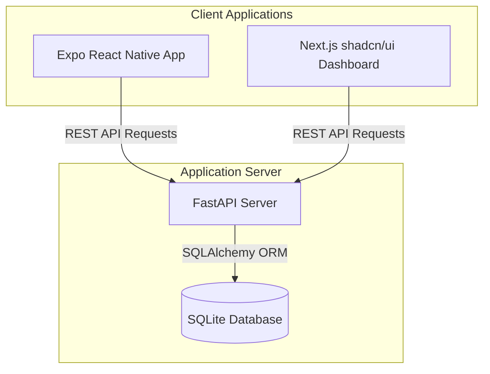

# System Patterns: PreClinic Architecture

## System Architecture

PreClinic uses a monorepo setup with a decoupled architecture:

## Key Technical Decisions

1. **Monorepo Layout:** Decoupled packages to run, build, and deploy independently.
2. **SQLite Database:** Local SQLite databases (`preclinic.db`) for lightweight development and offline consistency.
3. **Seed Data:** Pre-populate SQLite on initialization with patient lists and histories corresponding exactly to the Figma design layout to ensure high-fidelity UI demonstration.
4. **Tailwind Styling System:** Next.js uses Tailwind CSS for layout layout and shadcn/ui primitives. Mobile uses standard React Native stylesheets styled to match the exact hex codes.

## Design Patterns

- **API-First Design:** Backend models and serialization schemas drive state exchange.
- **Component Componentization:** The Next.js dashboard uses modular files for Sidebar, StatCards, PatientTable, and AIAnalysis blocks to maximize readability.
- **Zustand or Fetch Hooks:** Client applications consume FastAPI endpoints directly to ensure real-time reactive sync.
