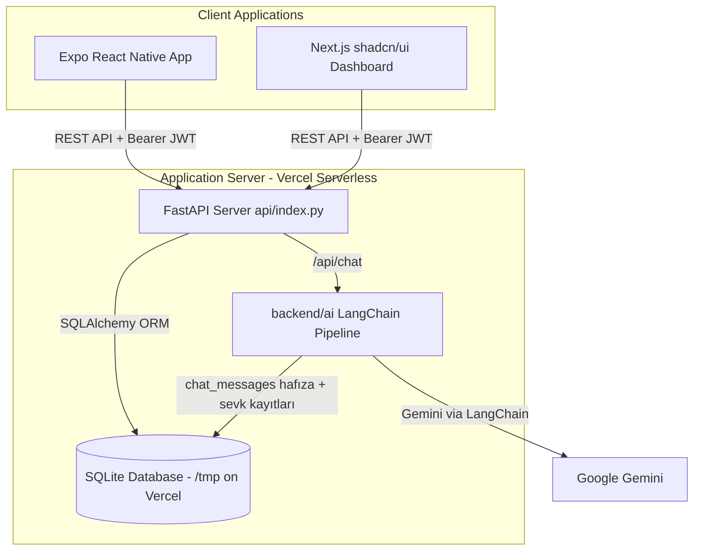

# System Patterns: PreClinic Architecture

## System Architecture

PreClinic uses a monorepo setup with a decoupled architecture:

```mermaid
graph TD
    subgraph Client Applications
        Mobile[Expo React Native App]
        Doctor[Next.js shadcn/ui Dashboard]
    end

    subgraph Application Server - Vercel Serverless
        API[FastAPI Server api/index.py]
        AI[backend/ai LangChain Pipeline]
        DB[(SQLite Database - /tmp on Vercel)]
    end

    Mobile -->|REST API + Bearer JWT| API
    Doctor -->|REST API + Bearer JWT| API
    API -->|SQLAlchemy ORM| DB
    API -->|/api/chat| AI
    AI -->|Gemini via LangChain| LLM[Google Gemini]
    AI -->|chat_messages hafıza + sevk kayıtları| DB
```

## Key Technical Decisions

1. **Monorepo Layout:** Decoupled packages (`backend`, `doctor-panel`, `mobile-app`) run, build, and deploy independently. Vercel'de iki ayrı proje: `preclinic-api` (monorepo kökü, `api/index.py` + `vercel.json`) ve `preclinic-panel` (`doctor-panel/` kökü).
2. **SQLite Database:** Local `preclinic.db`; Vercel serverless'ta salt-okunur dosya sistemi nedeniyle soğuk başlangıçta `/tmp`'ye kopyalanır (ephemeral). Kalıcılık gerekirse `DATABASE_URL` env ile harici DB.
3. **LangChain AI Katmanı (`backend/ai/`):** Sohbet tek prompt değil, LCEL pipeline'dır: DB tabanlı diyalog hafızası (`chat_messages`) → canlı bağlam enjeksiyonu (poliklinik kataloğu + hasta özgeçmişi) → `TriageDecision` Pydantic yapılandırılmış triyaj → sevk netleşince `SOAPReport` (ICD-10) → hasta dosyasına kayıt. Model yedekleme listesi + anahtar yokken kural tabanlı fallback.
4. **Seed Data:** `seed.py` tabloları drop/create edip Figma tasarımıyla eşleşen demo verisi ve demo hesapları yazar. Model şeması değiştiğinde (yeni kolon) reseed zorunludur (SQLite'ta otomatik migration yok).
5. **Tailwind Styling System:** Next.js uses Tailwind CSS v4 + shadcn/ui primitives. Mobile uses React Native stylesheets styled to the exact Figma hex codes.
6. **Auth Deseni:** JWT (7 gün) hem `localStorage`/`AsyncStorage` hem cookie'de (panel); panelde sunucu taraflı guard `src/proxy.ts` (Next 16'da middleware'in yeni adı). Mobilde `src/context/auth.tsx` AuthContext tek doğruluk kaynağıdır.
7. **API İstemci Deseni:** Her iki frontend'de `src/lib/api.ts` — `NEXT_PUBLIC_API_URL` / `EXPO_PUBLIC_API_URL` env fallback'li `apiFetch()` helper'ı Bearer'ı otomatik ekler. Hardcoded URL yasak.
8. **Türetilmiş Bildirimler:** `/api/notifications` ayrı tablo tutmaz; ACİL / KRİTİK TAKİP / sevk onayı durumlarından anlık türetilir.
9. **Sunucu Taraflı Veri Tutarlılığı:** Randevu kayıtları `POST /api/appointments/book` ile oluşturulur; tarih (`TEM 26` formatı) ve REC kodu sunucuda üretilir ki panel takvim bileşeni kırılmasın.

## Design Patterns

- **API-First Design:** Backend models and serialization schemas drive state exchange.
- **Component Componentization:** Next.js dashboard modüler bileşenler kullanır (Sidebar, NotificationsBell, StatCards, PatientTable, AIAnalysis).
- **Structured Output Pattern:** LLM çıktıları serbest metin değil, Pydantic şemalarına parse edilen JSON'dur; DB'ye tip güvenli yazılır.
- **Graceful Degradation:** Backend erişilemezse mobil uygulama çevrimdışı demo verisiyle çalışmaya devam eder; hata durumları kullanıcıya dürüstçe bildirilir (sahte success yok).
