# **PreClinic**

"Yapay Zeka ve Teknoloji Akademisi" bünyesinde "BOOTCAMP34" takımı olarak, mezuniyet bootcamp'i için hazırladığımız "Sağlık Teması: PreClinic" projemiz bu repo içinde yer almaktadır.

# **📌Takım İsmi**

BOOTCAMP-34

# **👾Takım Logosu**


# **👥Takım Üyeleri**
- <b>Ulaş Can DEMİRBAĞ</b> | Product Owner and Developer
- <b>Esra CANPOLAT</b> | Scrum Master and UI&UX Designer
- <b>Alper DUMAN</b> | Developer
- <b>Abdulaziz NALÇA</b> | Developer


# **★Tema**
❤️ Sağlık Teması

# **😎Proje İsmi**
-PreClinic-

# **🩺 Proje Açıklaması**
<p>PreClinic, modern sağlık sistemlerinde hekimlerin veri giriş yükünü azaltan ve hastaların semptomlarını doğru aktaramamasından kaynaklanan zaman kayıplarını çözen otonom bir klinik asistan platformudur. Hasta ile hekim arasındaki veri bariyerini ortadan kaldırarak, hastanın doğal dildeki dağınık ifadelerini uluslararası geçerliliğe sahip ICD-10 standartlarına uyumlu, yapılandırılmış tıbbi verilere dönüştürür.</p>


# **🛠️ Ürün Özellikleri**
<p>Doğal Dille Akıllı Sevk & MHRS Yönetimi: Hastanın "sol kolum sızlıyor" gibi kendi cümlelerini analiz ederek en doğru polikliniği belirler ve otomatik randevuya yönlendirir.</p> 
<p>SOAP Formatında Hekim Ön Bilgilendirme Paneli: Toplanan dağınık verileri tıbbi terminolojiye çevirerek hekimin ekranına standart bir Klinik Ön Anamnez Raporu olarak düşürür. </p> 
<p>Uzun Süreli Medikal Hafıza : Hastanın geçmiş şikayetleri ile güncel semptomları arasında "Cosine Similarity" kullanarak bağlamsal ilişkiler kurar ve hekime kritik uyarılar üretir.</p> 
<p>Proaktif Taburcu Sonrası Takip: Muayene sonrasında hastayı otonom takibe alarak periyodik semptom sorgulaması yapar ve anomali durumunda hekimi uyarır.</p> 


# **🤖 Hedef Kitlemiz**
<p>Hastaneler ve Sağlık Kuruluşları: Randevu sıkışıklığını çözmek ve günlük hasta bakma kapasitesini artırmak isteyen kurumlar.</p> 
<p>Doktorlar: Muayene sırasında veri girişiyle vakit kaybetmek istemeyen ve hastanın geçmiş bağlamına hızla erişmek isteyen sağlık profesyonelleri.</p> <p>Hastalar: Doğru polikliniği seçmekte zorlanan, muayene odasında stres sebebiyle şikayetlerini eksik anlatan tüm bireyler.</p> 

 # 📋Product Backlog 

**🔹 Sprint 1 Raporu: PreClinic UI/UX Tasarım Süreci**

**Sprint Notları:**
 Kullanıcı Tasarımı Düzeni: Kullanıcı hikayeleri doğrudan Product Backlog öğelerinin içerisine gömülmüştür. Detaylar ve kabul kriterleri ilgili backlog öğesine tıklandığında görülebilir.

**Tahmin Edilen Sprint Puanı:** 100 Puan (Toplam 300 puanlık UI/UX backlog'unun ilk aşaması).

**Puan Tamamlama Mantığı:** Proje boyunca tamamlanması gereken toplam 300 puanlık backlog bulunmaktadır. 3 sprinte bölündüğünde ilk sprintin 100 ile başlaması gerektiği kararlaştırıldı.

**Backlog ve Görev Seçim Mantığı:** İlk sprint, uygulamanın tasarım dilini oturtmak ve en kritik iki akışı (Hasta ve Hekim arayüzleri) çözmek üzere planlanmıştır.


**Daily Scrum (Günlük Toplantılar):**
İletişim Kanalları: Günlük senkronizasyon toplantıları Meet üzerinden sesli olarak gerçekleştirilmiş, gün içi anlık geri bildirimler ve ekran görüntüsü paylaşımları için WhatsApp kanalı aktif olarak kullanılmıştır.

**Sprint board update:** Sprint board screenshot:
Proje yönetim sürecimizi ve görev dağılımlarımızı takip ettiğimiz Trello panomuza ulaşmak için: [Tıklayınız](https://trello.com/invite/b/6a4803339c72c94c17004040/ATTI59563a330b005374347a33f751b27ed55D008F52/my-trello-board).


 **Toplantı Kayıtları:** Daily Scrum ekran görüntüleri ve chat geçmişleri klasörüne ulaşmak için: [Tıklayınız](https://github.com/YZTA-Bootcamp-Group-34/Monorepo/tree/871d06ea573eb72324a458983d88293659868371/SOHBET%20RES%C4%B0MLER%C4%B0).


# **Ürün Durumu**

Sprint sonunda Figma üzerinde başarıyla tamamlanan ve "Yazılıma Hazır" konumuna getirilen ekranlar ve çıktılar:


**PreClinic Mobil UI/UX Tasarım Çıktıları:**
Tasarım Sistemi ve Stil Kılavuzu: Renk paleti (sağlık ve güven veren asistan tonları), tipografi, butonlar ve input alanları.
Hasta Semptom Giriş Ekranı: Hastanın "Başım çok ağrıyor, ateş hissim var" gibi dağınık ifadelerini girebildiği akıllı chatbot/asistan arayüzü.
Hekim İnceleme Paneli (ICD-10 Output): Yapay zekanın dönüştürdüğü yapılandırılmış tıbbi verilerin ve ICD-10 kodlarının hekim tarafından onaylandığı minimalist ve göz yormayan mobil dashboard arayüzü.

**Sprint Review:**
Görüşler ve Çıktılar: Tüm ekip Sprint 1 sonunda Figma üzerindeki yüksek sadakatli  prototipi inceledi ve test etti. Tasarlanan "Doğal dilden ICD-10 koduna dönüşüm" animasyonları ve veri görselleştirme kutuları ekip tarafından oldukça işlevsel ve modern bulundu. Hekim arayüzündeki minimalist yaklaşımın, hekimlerin veri giriş yükünü azaltma hedefini tam olarak karşıladığı onaylandı.

**Katılımcılar:** 
Esra Canpolat,Ulaş Can Demirbağ,Alper Duman,Abdulaziz Nalça.

**Sprint Retrospective:**
Ekip, sonraki sprintlerde tasarımın kalitesini artırmak ve yazılım aşamasına geçişi kolaylaştırmak adına iki çalışma grubuna ayrılmıştır:

Grup 1(Tasarım Kalitesi):Esra Canpolat

Grup 2(Yazılım Ekibi):Ulaş Can Demirbağ,Alper Duman,Abdulaziz Nalça.

Toplantıların belirli bir zaman aralığıyla gerçekleştirilmesi kararlaştırıldı.

Üretim aşamasında görev alan ekip üyelerine gelecek bölümlerde ihtiyaç duyulabilecek assetlerin üretimi için listeler hazırlandı


**Gelecek Sprint Hazırlığı:** Yazılım ekibinin doğrudan üretime başlayabilmesi için Figma bileşenlerinin (Components) isimlendirmeleri ve Auto Layout yapıları standardize edilmiştir.

---

# 🏗️ Proje Mimarisi ve Çalıştırma Kılavuzu

PreClinic, tek bir repository içinde 3 ana bağımsız modülden oluşan bir Monorepo yapısına sahiptir:

```
Monorepo/
├── backend/               # Python FastAPI + SQLAlchemy ORM + SQLite
│   ├── database.py        # SQLite Bağlantı Konfigürasyonu
│   ├── models.py          # Veritabanı Tablo Yapıları (SQLAlchemy)
│   ├── main.py            # API Uç Noktaları ve Chatbot Yönlendirme Mantığı
│   └── seed.py            # Figma Ekran Görüntüleriyle Eşleşen Tohumlama Verisi
│
├── doctor-panel/          # Next.js 16 + React 19 + Tailwind CSS v4 + shadcn/ui
│   ├── src/components/    # Sidebar ve Dashboard Arayüz Bileşenleri
│   └── src/app/           # Hasta Yönetimi Paneli & Hasta SOAP Detay Sayfası
│
└── mobile-app/            # Expo Router (React Native) + React Native Paper + Vector Icons
    ├── src/app/           # Chatbot, Bölümler, Geçmiş ve Profil Sekme Ekranları
    └── src/components/    # Figma Tasarımına Birebir Uygun Nane Yeşili Kapsül TabBar
```

## 🚀 Kurulum ve Çalıştırma Adımları

Projeleri çalıştırmadan önce terminalde monorepo kök dizininde (`/Users/ulascandemirbag/Development/Monorepo`) olduğunuzdan emin olun.

### 1. Python FastAPI Backend'i Çalıştırma
```bash
# Backend klasörüne geçin
cd backend

# Gerekli bağımlılıkları yükleyin
pip install -r requirements.txt

# Veritabanını tohumlayın (Tüm Figma verilerini SQLite'a yazar)
python3.11 -m backend.seed

# API sunucusunu yerel olarak 8000 portunda başlatın
python3.11 -m uvicorn backend.main:app --reload --port 8000
```
*API interaktif dokümantasyonuna http://localhost:8000/docs adresinden ulaşabilirsiniz.*

### 2. Next.js Hekim Paneli Arayüzünü Çalıştırma
Yeni bir terminal sekmesinde:
```bash
# Doctor-panel klasörüne geçin
cd doctor-panel

# Geliştirici sunucusunu başlatın
npm run dev
```
*Hekim ön bilgilendirme paneline http://localhost:3000 adresinden erişebilirsiniz.*

### 3. Expo Mobil Hasta Uygulamasını Çalıştırma
Yeni bir terminal sekmesinde:
```bash
# Mobile-app klasörüne geçin
cd mobile-app

# Web tarayıcısı üzerinde çalıştırmak için (Simülasyon kolaylığı sağlar)
npm run web
```

---

# 📊 Sistem Modelleme ve Diyagramlar

PreClinic projesinin veri akışı, veritabanı modelleri ve kullanım senaryoları aşağıda Mermaid şemalarıyla modellenmiştir.

## 🗄️ 1. Veritabanı İlişkisel Modellemesi (UML ERD)

SQLite veritabanı üzerinde tanımlı tablolar ve aralarındaki bire-çok (`1-to-many`) ve bire-bir (`1-to-1`) ilişkiler aşağıdaki gibidir:

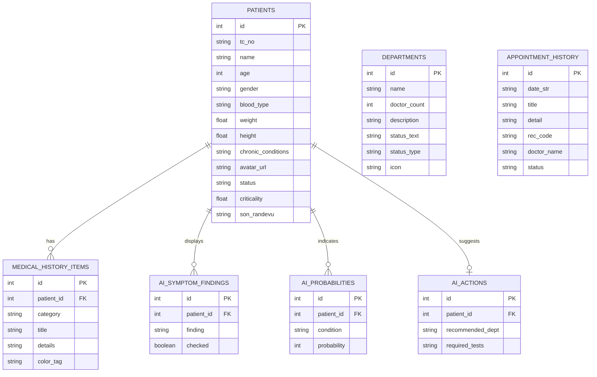

---

## 🎭 2. Kullanım Senaryoları (Use Cases)

Sistemdeki iki temel aktörün (Hasta ve Hekim) platform ile girdikleri etkileşim senaryoları:

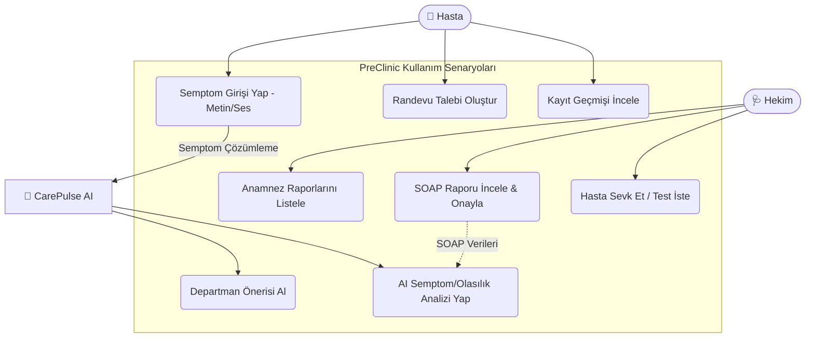

---

## 🔄 3. Sistem İş Akış Şeması (Flowchart)

Semptomun hasta tarafından girilmesinden, hekim tarafından incelenip onaylanmasına kadar olan uçtan uca veri akışı:

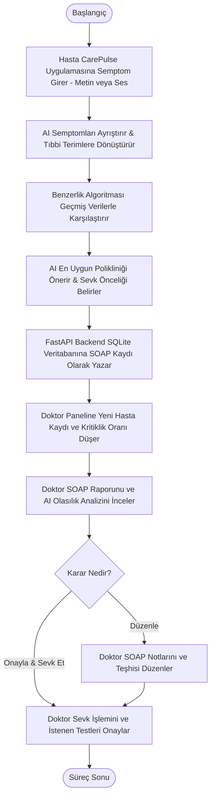

# **Sprint 2**
## Sprint 2 Raporu: PreClinic Geliştirme ve Entegrasyon Süreci
* **Sprint Notları:** Kullanıcı hikayeleri doğrudan Product Backlog öğelerinin içerisine gömülmüş olup, detaylar ve kabul kriterleri ilgili backlog öğesine tıklandığında okunabilmektedir. 

* **Sprint içinde tamamlanması tahmin edilen puan:** 100 Puan

* **Puan tamamlama mantığı:** Proje boyunca tamamlanması gereken toplam 300 puanlık backlog bulunmaktadır. 3 sprinte bölündüğünde ikinci sprintin 100 puandan oluşması gerektiği kararlaştırıldı.

* **Backlog ve Görev Seçim Mantığı:** Backlog'umuz, kullanıcıların (hasta ve hekim) ihtiyaç duyacağı temel mekanik ve içerikleri en doğru sırayla besleyecek şekilde düzenlenmiştir. İlk sprint, uygulamanın genel tasarım dilini oturtmak ve en kritik iki akışı (Hasta ve Hekim arayüzleri) çözmek üzere planlanmıştır. 2. sprint ise bu oturtulan tasarım dili ve ekran haritaları üzerinden uygulamanın temel mekanik yazılımlarını, veri modellemelerini ve yapay zeka entegrasyon altyapısını kodlamak üzere kurgulanmıştır. Görevler, sprint başına tahmin edilen puan sınırını (100 Puan) geçmeyecek şekilde dengeli bir şekilde dağıtılmıştır.
Trello panomuzda yer alan kartların renk kodlaması (etiket mantığı) şu şekildedir:

     **-Pembe&Mavi Kartlar:** İlk sprint görevleri

     **-Sarı Kartlar:** Yazılımcı görevleri

     **-Yeşil Kartlar:** Sunum-Son kontrol görevleri


* **Daily Scrum (Günlük Toplantılar):**
İletişim Kanalları: Günlük senkronizasyon toplantıları Meet üzerinden sesli olarak gerçekleştirilmiş, gün içi anlık geri bildirimler ve ekran görüntüsü paylaşımları için WhatsApp kanalı aktif olarak kullanılmıştır.

 * **Toplantı Kayıtları:** Daily Scrum ekran görüntüleri ve chat geçmişleri klasörüne ulaşmak için: [Tıklayınız](https://github.com/YZTA-Bootcamp-Group-34/Monorepo/tree/dd609f238b70489dee2c6cc7ddb8e4933276a585/sprint2bulu%C5%9Fmalar).

 * **Sprint board update:** Sprint board screenshot: Proje yönetim sürecimizi ve görev dağılımlarımızı takip ettiğimiz Trello panomuza ulaşmak için: [Tıklayınız](https://trello.com/b/1D4BDI4I/grup34)
 
 

# **Ürün Durumu (Görseller)**

Uygulamanın çalışan en son sürümüne ait canlı ürün ekran görüntüleri aşağıda listelenmiştir:

### 📱 1. CarePulse Mobil Hasta Uygulaması (Expo)
Hastaların semptom analizi yaptığı, poliklinik randevusu aldığı ve ameliyat sonrası takibini gerçekleştirdiği mobil arayüz:

<p align="center">
  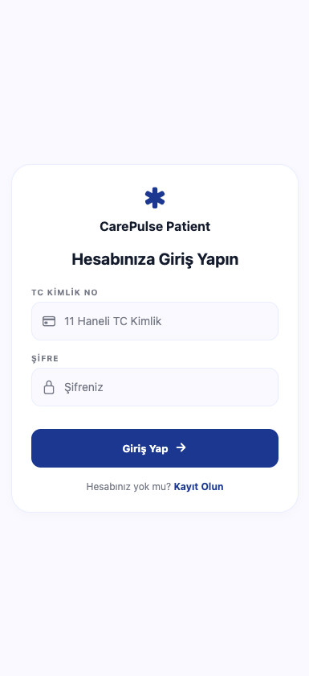
  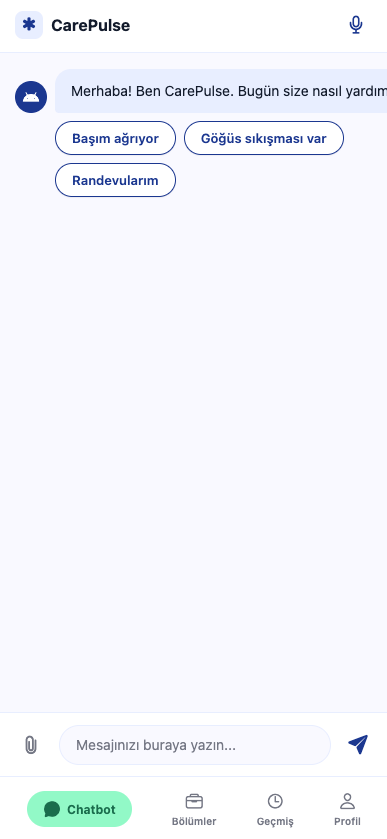
  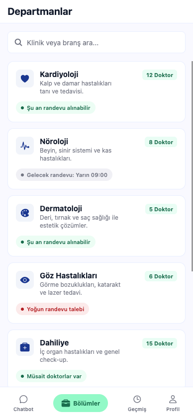
</p>
<p align="center">
  <em>Giriş Ekranı, Onboarding Tanıtım Slaytları ve Biyometrik Profil Kurulum Formu</em>
</p>

<p align="center">
  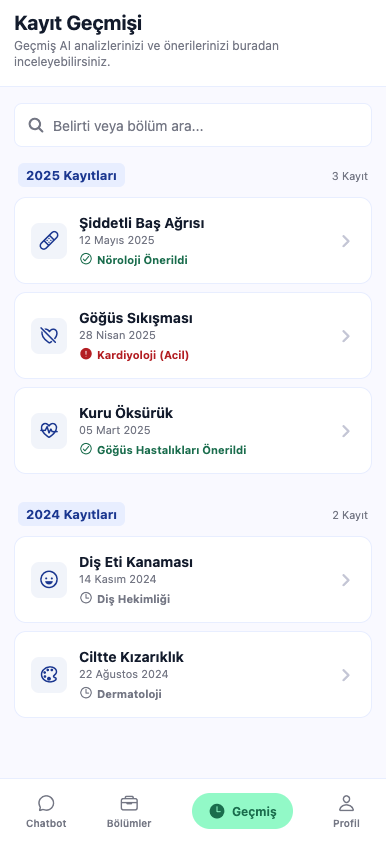
  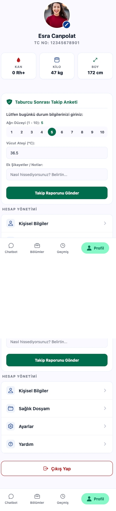
</p>
<p align="center">
  <em>CarePulse AI Asistanı Sohbet Ekranı ve Genişletilebilir Poliklinik Hekim/Saat Seçimi</em>
</p>

---

### 🩺 2. PreClinic Hekim Yönetim Paneli (Next.js)
Hekimlerin gelen hastaları, AI teşhis oranlarını, kritiklik seviyelerini ve taburcu sonrası takip alarmlarını incelediği web kontrol paneli:

<p align="center">
  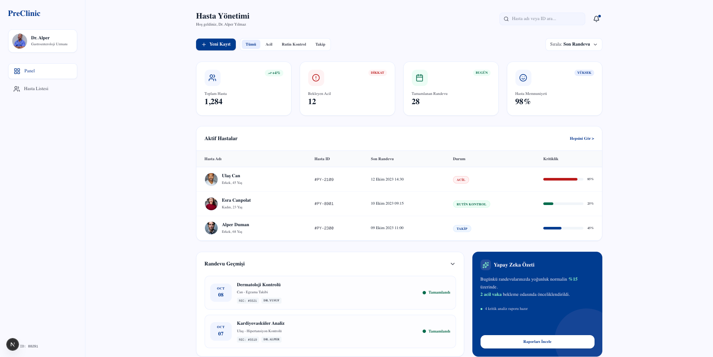
</p>
<p align="center">
  <em>Hekim Ana Dashboard Ekranı - Hasta Listesi, İskelet Yükleyiciler (Skeletons) ve Kritik Takip Alarmları</em>
</p>

<p align="center">
  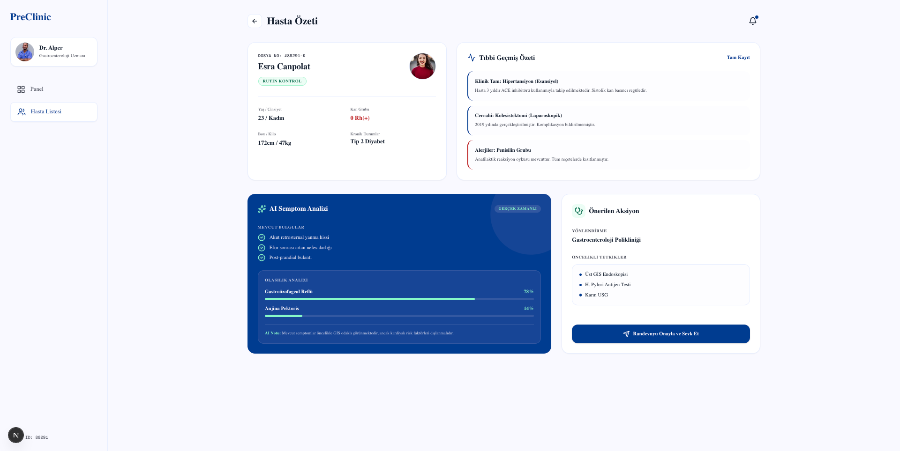
</p>
<p align="center">
  <em>Hasta Detay Ekranı - Yapay Zeka SOAP Analiz Raporu ve Klinik Risk Uyarıları</em>
</p>

<p align="center">
  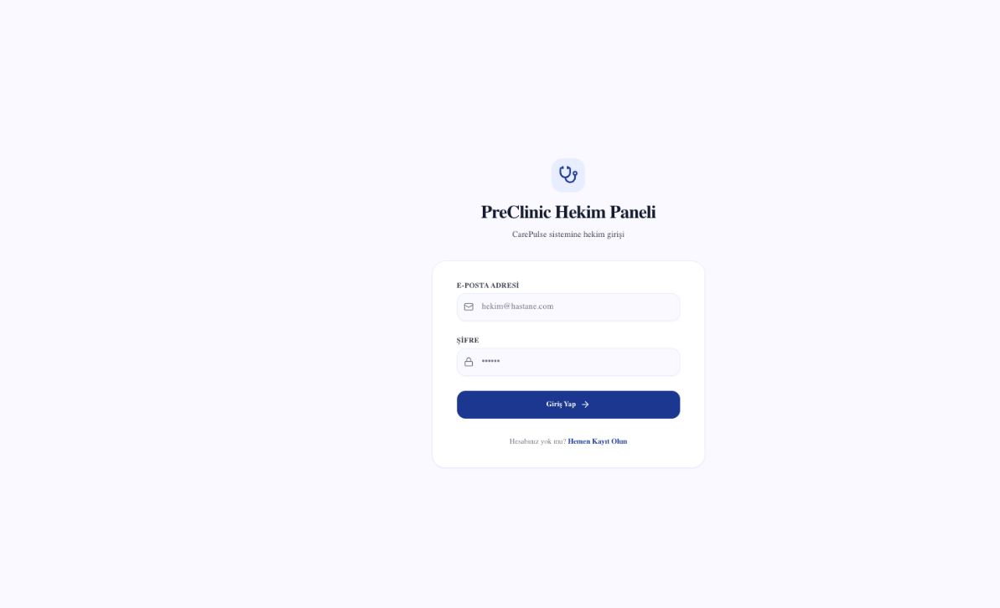
</p>
<p align="center">
  <em>Yeni Kaydolan Hekimler için Branş Kurulumu ve Lisans No Doğrulama Ekranı</em>
</p>

---

### ⚙️ 3. PreClinic Güvenli Backend Servisi (FastAPI)
Tüm servisleri besleyen, JWT Bearer yetkilendirmesiyle korunan SQLite tabanlı FastAPI RESTful API:

<p align="center">
  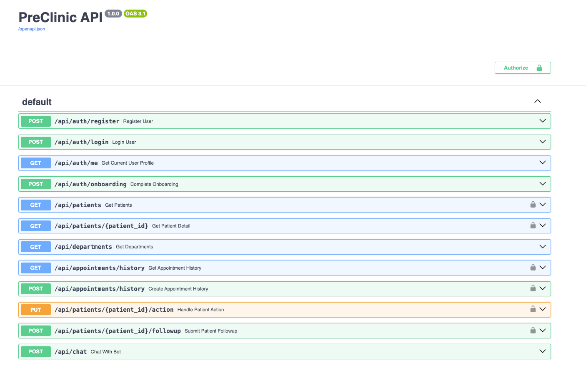
</p>
<p align="center">
  <em>FastAPI Swagger UI - Güvenli JWT API Dokümantasyon Arayüzü</em>
</p>


* **Sprint Review:**

  -Frontend kısmı tamamen bitirilmiş olup, geriye sadece Backend kısmı kalmıştır.API ksımı dışında     istenilen amaçlara ulaşışmıştır.

  -Sprint Review katılımcıları: Esra Canpolat,Ulaş Can Demirbağ,Alper Duman,Abdulaziz Nalça.

* **Sprint Retrospective:**
** *Sprint Retrospective (Sprint Özeleştirisi):**

**-Frontend Sürecinin Başarıyla Tamamlanması:** 
  * Sprint 2'nin en büyük başarısı, uygulamanın hem mobil hem de web platformlarındaki tüm **Frontend (arayüz kodlama) çalışmalarının %100 oranında tamamlanmış olmasıdır.** 
  * Hasta ve Hekim arayüzleri, veri görselleştirme panelleri ve "Doğal dilden ICD-10 koduna dönüşüm" ekranlarının tüm görsel kodlamaları, responsive (duyarlı) tasarımları ve sayfa geçişleri eksiksiz şekilde bitirilmiştir. Kod tabanı, sonraki aşamada yapılacak olan backend entegrasyonu için tamamen hazır ve temiz bir hale getirilmiştir.

* **Çalışma Gruplarının Rol Dağılımı ve Sinerji:**
  Frontend aşamasının başarıyla noktalanmasının ardından, sonraki sprintlerde tasarımın kalitesini daha da yukarı taşımak ve kalan backend/API entegrasyon sürecini hızlandırmak adına ekibin iki uzmanlık grubuna ayrılmasına karar verilmiştir:
  * **Grup 1 (Tasarım Kalitesi) - Esra Canpolat:** Tamamlanan frontend ekranlarının görsel kalitesini denetleyecek, kullanıcı deneyimini (UX) optimize edecek ve sonraki aşamalar için görsel standartları koruyacaktır.
  * **Grup 2 (Yazılım Ekibi) - Ulaş Can Demirbağ, Alper Duman, Abdulaziz Nalça:** Tamamen biten arayüzlerin arkasına kurulacak olan veritabanı, yapay zeka API bağlantıları ve veri akışı (backend) süreçlerini üstlenecektir.

* **Toplantı ve İletişim Düzeni:** 
  * Frontend aşamasından backend aşamasına geçişteki koordinasyonu kusursuz sağlamak adına, toplantıların belirli ve sabit zaman aralıklarıyla (periyodik olarak) gerçekleştirilmesi kararlaştırılmıştır. Bu sayede tasarım revizeleri ve kod entegrasyonları anlık olarak senkronize edilecektir.

* **Gelecek Aşamalar İçin Asset Hazırlığı:** 
  * Geliştirme sürecinde herhangi bir aksama yaşanmaması adına, üretim aşamasında görev alan ekip üyelerine sonraki bölümlerde ve ekranlarda ihtiyaç duyulabilecek tüm görsel materyallerin, ikon setlerinin ve arayüz bileşenlerinin (asset) yer aldığı detaylı listeler hazırlanmış ve teslim edilmiştir.


