# **PreClinic**

"Yapay Zeka ve Teknoloji Akademisi" bünyesinde "BOOTCAMP34" takımı olarak, mezuniyet bootcamp'i için hazırladığımız "Sağlık Teması: PreClinic" projemiz bu repo içinde yer almaktadır.

# **📌Takım İsmi**

BOOTCAMP-34

# **👾Takım Logosu**


# **👥Takım Üyeleri**
- <b>Ulaş Can DEMİRBAĞ</b> | Product Owner and Developer
- <b>Esra CANPOLAT</b> | Scrum Master and UI&UX Designer
- <b>Alper DUMAN</b> | Developer
- <b>Abdulaziz NALÇA</b> | Developer


# **★Tema**
❤️ Sağlık Teması

# **😎Proje İsmi**
-PreClinic-

# **🩺 Proje Açıklaması**
<p>PreClinic, modern sağlık sistemlerinde hekimlerin veri giriş yükünü azaltan ve hastaların semptomlarını doğru aktaramamasından kaynaklanan zaman kayıplarını çözen otonom bir klinik asistan platformudur. Hasta ile hekim arasındaki veri bariyerini ortadan kaldırarak, hastanın doğal dildeki dağınık ifadelerini uluslararası geçerliliğe sahip ICD-10 standartlarına uyumlu, yapılandırılmış tıbbi verilere dönüştürür.</p>


# **🛠️ Ürün Özellikleri**
<p>Doğal Dille Akıllı Sevk & MHRS Yönetimi: Hastanın "sol kolum sızlıyor" gibi kendi cümlelerini analiz ederek en doğru polikliniği belirler ve otomatik randevuya yönlendirir.</p> 
<p>SOAP Formatında Hekim Ön Bilgilendirme Paneli: Toplanan dağınık verileri tıbbi terminolojiye çevirerek hekimin ekranına standart bir Klinik Ön Anamnez Raporu olarak düşürür. </p> 
<p>Uzun Süreli Medikal Hafıza : Hastanın geçmiş şikayetleri ile güncel semptomları arasında "Cosine Similarity" kullanarak bağlamsal ilişkiler kurar ve hekime kritik uyarılar üretir.</p> 
<p>Proaktif Taburcu Sonrası Takip: Muayene sonrasında hastayı otonom takibe alarak periyodik semptom sorgulaması yapar ve anomali durumunda hekimi uyarır.</p>
<p>Canlı Poliklinik Kadrosu & Randevu: Bölüm kartlarında hekim kadrosu ve müsait saatler canlı API'den gelir; randevu kaydının tarihi ve REC kodu sunucu tarafında üretilerek panel-mobil veri tutarlılığı garanti edilir.</p>
<p>Canlı Hekim Bildirimleri: Panel zili, ACİL / KRİTİK TAKİP / sevk onayı durumlarından anlık türetilen bildirimleri listeler ve ilgili hasta dosyasına tek tıkla götürür.</p>
<p>Kişiselleştirilebilir Hasta Profili: Avatar seçimi ve bildirim tercihi dahil tüm profil alanları API üzerinden kalıcı olarak saklanır; hekim panelinden manuel yeni hasta kaydı da açılabilir.</p> 


# **🌐 Canlı Demo (Production)**

| Servis / Materyal | URL | Açıklama |
|---|---|---|
| 🎬 Uygulama Tanıtım Videosu | [YouTube'da İzle (PreClinic)](https://www.youtube.com/watch?v=nNC-Fhe0jNU) | Uçtan uca uygulamanın çalışma mantığı ve tanıtım videosu |
| 🩺 Hekim Paneli (Next.js) | https://preclinic-panel.vercel.app | Hekim girişi, hasta listesi, SOAP raporları, randevular, ayarlar |
| ⚙️ Backend API (FastAPI) | https://preclinic-api.vercel.app | REST API — interaktif dokümantasyon: `/docs` |
| 📱 Mobil Uygulama (Expo) | [Expo EAS Build Sayfası](https://expo.dev/accounts/ulascan54/projects/preclinic-carepulse/builds/49367e4d-e564-4ca6-a0b9-4c2608835f78) \| [Direkt APK İndir](APK/application-49367e4d-e564-4ca6-a0b9-4c2608835f78.apk) | Live Android APK ve Expo Derleme Sayfası (Aşağıdaki Kurulum bölümüne bakınız) |

**Demo Hesaplar (seed verisi):**

| Rol | Kullanıcı Adı | Şifre |
|---|---|---|
| Hekim | `dr.alper@preclinic.com` | `123456` |
| Hekim | `dr.yusuf@preclinic.com` | `123456` |
| Hasta (TC No) | `12345678901` | `123456` |

> **Not:** Canlı ortam **Supabase (Postgres)** üzerinde çalışır — veriler kalıcıdır. `DATABASE_URL` tanımlı
> olmadığında backend otomatik olarak SQLite'a düşer (lokalde kök dizindeki `preclinic.db`, Vercel'de `/tmp`
> üzerinde ephemeral demo modu). Ayrıntılar için "Kalıcı Veritabanı — Supabase" bölümüne bakınız.

# **🤖 Hedef Kitlemiz**
<p>Hastaneler ve Sağlık Kuruluşları: Randevu sıkışıklığını çözmek ve günlük hasta bakma kapasitesini artırmak isteyen kurumlar.</p> 
<p>Doktorlar: Muayene sırasında veri girişiyle vakit kaybetmek istemeyen ve hastanın geçmiş bağlamına hızla erişmek isteyen sağlık profesyonelleri.</p> <p>Hastalar: Doğru polikliniği seçmekte zorlanan, muayene odasında stres sebebiyle şikayetlerini eksik anlatan tüm bireyler.</p> 

 # 📋Product Backlog 

**🔹 Sprint 1 Raporu: PreClinic UI/UX Tasarım Süreci**

**Sprint Notları:**
 Kullanıcı Tasarımı Düzeni: Kullanıcı hikayeleri doğrudan Product Backlog öğelerinin içerisine gömülmüştür. Detaylar ve kabul kriterleri ilgili backlog öğesine tıklandığında görülebilir.

**Tahmin Edilen Sprint Puanı:** 100 Puan (Toplam 300 puanlık UI/UX backlog'unun ilk aşaması).

**Puan Tamamlama Mantığı:** Proje boyunca tamamlanması gereken toplam 300 puanlık backlog bulunmaktadır. 3 sprinte bölündüğünde ilk sprintin 100 ile başlaması gerektiği kararlaştırıldı.

**Backlog ve Görev Seçim Mantığı:** İlk sprint, uygulamanın tasarım dilini oturtmak ve en kritik iki akışı (Hasta ve Hekim arayüzleri) çözmek üzere planlanmıştır.


**Daily Scrum (Günlük Toplantılar):**
İletişim Kanalları: Günlük senkronizasyon toplantıları Meet üzerinden sesli olarak gerçekleştirilmiş, gün içi anlık geri bildirimler ve ekran görüntüsü paylaşımları için WhatsApp kanalı aktif olarak kullanılmıştır.

**Sprint board update:** Sprint board screenshot:
Proje yönetim sürecimizi ve görev dağılımlarımızı takip ettiğimiz Trello panomuza ulaşmak için: [Tıklayınız](https://trello.com/invite/b/6a4803339c72c94c17004040/ATTI59563a330b005374347a33f751b27ed55D008F52/my-trello-board).


 **Toplantı Kayıtları:** Daily Scrum ekran görüntüleri ve chat geçmişleri klasörüne ulaşmak için: [Tıklayınız](https://github.com/YZTA-Bootcamp-Group-34/Monorepo/tree/871d06ea573eb72324a458983d88293659868371/SOHBET%20RES%C4%B0MLER%C4%B0).


# **Ürün Durumu**

Sprint sonunda Figma üzerinde başarıyla tamamlanan ve "Yazılıma Hazır" konumuna getirilen ekranlar ve çıktılar:


**PreClinic Mobil UI/UX Tasarım Çıktıları:**
Tasarım Sistemi ve Stil Kılavuzu: Renk paleti (sağlık ve güven veren asistan tonları), tipografi, butonlar ve input alanları.
Hasta Semptom Giriş Ekranı: Hastanın "Başım çok ağrıyor, ateş hissim var" gibi dağınık ifadelerini girebildiği akıllı chatbot/asistan arayüzü.
Hekim İnceleme Paneli (ICD-10 Output): Yapay zekanın dönüştürdüğü yapılandırılmış tıbbi verilerin ve ICD-10 kodlarının hekim tarafından onaylandığı minimalist ve göz yormayan mobil dashboard arayüzü.

**Sprint Review:**
Görüşler ve Çıktılar: Tüm ekip Sprint 1 sonunda Figma üzerindeki yüksek sadakatli  prototipi inceledi ve test etti. Tasarlanan "Doğal dilden ICD-10 koduna dönüşüm" animasyonları ve veri görselleştirme kutuları ekip tarafından oldukça işlevsel ve modern bulundu. Hekim arayüzündeki minimalist yaklaşımın, hekimlerin veri giriş yükünü azaltma hedefini tam olarak karşıladığı onaylandı.

**Katılımcılar:** 
Esra Canpolat,Ulaş Can Demirbağ,Alper Duman,Abdulaziz Nalça.

**Sprint Retrospective:**
Ekip, sonraki sprintlerde tasarımın kalitesini artırmak ve yazılım aşamasına geçişi kolaylaştırmak adına iki çalışma grubuna ayrılmıştır:

Grup 1(Tasarım Kalitesi):Esra Canpolat

Grup 2(Yazılım Ekibi):Ulaş Can Demirbağ,Alper Duman,Abdulaziz Nalça.

Toplantıların belirli bir zaman aralığıyla gerçekleştirilmesi kararlaştırıldı.

Üretim aşamasında görev alan ekip üyelerine gelecek bölümlerde ihtiyaç duyulabilecek assetlerin üretimi için listeler hazırlandı


**Gelecek Sprint Hazırlığı:** Yazılım ekibinin doğrudan üretime başlayabilmesi için Figma bileşenlerinin (Components) isimlendirmeleri ve Auto Layout yapıları standardize edilmiştir.

---

# 🏗️ Proje Mimarisi ve Çalıştırma Kılavuzu

PreClinic, tek bir repository içinde 3 ana bağımsız modülden oluşan bir Monorepo yapısına sahiptir:

```
Monorepo/
├── api/                   # Vercel Serverless Giriş Noktası (backend'i sarmalar)
│   └── index.py
├── vercel.json            # Backend Vercel yönlendirme/fonksiyon konfigürasyonu
├── requirements.txt       # Vercel Python runtime bağımlılıkları
│
├── backend/               # Python FastAPI + SQLAlchemy ORM + SQLite
│   ├── database.py        # SQLite Bağlantısı (Vercel'de /tmp, lokalde kök dizin)
│   ├── models.py          # Veritabanı Tabloları (+ chat_messages diyalog hafızası)
│   ├── main.py            # API Uç Noktaları, JWT Auth, Pipeline Entegrasyonu
│   ├── seed.py            # Figma Ekran Görüntüleriyle Eşleşen Tohumlama Verisi
│   └── ai/                # 🧠 CarePulse LangChain AI Katmanı
│       ├── llm.py         #   Gemini model fabrikası (model fallback listesiyle)
│       ├── schemas.py     #   Pydantic yapılandırılmış çıktılar (TriageDecision, SOAPReport)
│       ├── chains.py      #   LCEL zincirleri: triyaj + SOAP (prompt | llm | parser)
│       ├── memory.py      #   SQLite tabanlı kalıcı diyalog hafızası
│       ├── tools.py       #   Canlı DB bağlamı: poliklinik kataloğu, hasta özgeçmişi
│       ├── similarity.py  #   Kosinüs benzerliği tıbbi hafıza motoru
│       ├── pipeline.py    #   Orkestrasyon: hafıza→bağlam→triyaj→SOAP→sevk kaydı
│       └── fallback.py    #   API anahtarı yokken kural tabanlı çevrimdışı diyalog
│
├── doctor-panel/          # Next.js 16 + React 19 + Tailwind CSS v4 + shadcn/ui
│   ├── src/lib/api.ts     # Ortak API istemcisi (NEXT_PUBLIC_API_URL + Bearer)
│   ├── src/proxy.ts       # Sunucu taraflı auth guard (Next 16 middleware/proxy)
│   ├── src/components/    # Sidebar ve Dashboard Arayüz Bileşenleri
│   └── src/app/
│       ├── (dashboard)/   # Sidebar'lı korumalı alan
│       │   ├── page.tsx           # Ana Panel (istatistikler + aktif hastalar)
│       │   ├── patients/          # Hasta Listesi (arama + kritiklik) & SOAP Detay
│       │   ├── appointments/      # Randevu Geçmişi
│       │   └── settings/          # Hekim Profili + Çıkış
│       ├── login/ register/ onboarding/   # Sidebar'sız auth sayfaları
│       └── layout.tsx
│
└── mobile-app/            # Expo SDK 57 (expo-router) + React Native Paper
    ├── src/lib/api.ts     # Ortak API istemcisi (EXPO_PUBLIC_API_URL + Bearer)
    ├── src/context/auth.tsx  # AuthContext: token, profil, anlık çıkış
    ├── eas.json           # EAS Build profilleri (APK üretimi)
    └── src/app/
        ├── index.tsx      # CarePulse AI Sohbet (Chatbot sekmesi)
        ├── departments.tsx# Bölümler + hekim/saat seçimi
        ├── history.tsx    # Randevu Geçmişi (canlı API verisi)
        ├── profile.tsx    # Profil + Taburcu Sonrası Takip Anketi
        ├── personal-info.tsx  # Alt Sayfa: Kişisel Bilgiler (biyometri düzenleme)
        ├── health-file.tsx    # Alt Sayfa: Sağlık Dosyam (VKİ, kronik, sevk durumu)
        ├── settings.tsx       # Alt Sayfa: Ayarlar + Çıkış
        └── help.tsx           # Alt Sayfa: Yardım / SSS
```

## 🚀 Kurulum ve Çalıştırma Adımları

Projeleri çalıştırmadan önce terminalde monorepo kök dizininde (`/Users/ulascandemirbag/Development/Monorepo`) olduğunuzdan emin olun.

### 1. Python FastAPI Backend'i Çalıştırma
```bash
# Backend klasörüne geçin
cd backend

# Gerekli bağımlılıkları yükleyin
pip install -r requirements.txt

# Veritabanını tohumlayın (Tüm Figma verilerini SQLite'a yazar)
python3.11 -m backend.seed

# API sunucusunu yerel olarak 8000 portunda başlatın
python3.11 -m uvicorn backend.main:app --reload --port 8000
```
*API interaktif dokümantasyonuna http://localhost:8000/docs adresinden ulaşabilirsiniz.*

> **Gemini API Anahtarı:** `backend/.env` dosyasına `GEMINI_API_KEY=...` ekleyin (canlı ortamda tanımlıdır ✅).
> Anahtar tanımlıysa LangChain tabanlı CarePulse pipeline'ı (canlı triyaj + SOAP üretimi) çalışır;
> tanımlı değilse sistem otomatik olarak kural tabanlı çevrimdışı demo diyaloğuna düşer.
> Model `GEMINI_MODEL` değişkeniyle değiştirilebilir (varsayılan: `gemini-flash-latest` — Google'ın
> güncel tuttuğu alias; sabit sürüm adları zamanla kapatılabildiği için "latest" tercih edilmiştir).

### 2. Next.js Hekim Paneli Arayüzünü Çalıştırma
Yeni bir terminal sekmesinde:
```bash
# Doctor-panel klasörüne geçin
cd doctor-panel

# Geliştirici sunucusunu başlatın
npm run dev
```
*Hekim ön bilgilendirme paneline http://localhost:3000 adresinden erişebilirsiniz.*

### 3. Expo Mobil Hasta Uygulamasını Çalıştırma
Yeni bir terminal sekmesinde:
```bash
# Mobile-app klasörüne geçin
cd mobile-app

# Web tarayıcısı üzerinde çalıştırmak için (Simülasyon kolaylığı sağlar)
npm run web
```

---

# 🔌 REST API Referansı

| Metot | Uç Nokta | Auth | Açıklama |
|---|---|---|---|
| POST | `/api/auth/register` | - | Hasta/hekim kaydı → JWT token |
| POST | `/api/auth/login` | - | Giriş → JWT token |
| GET | `/api/auth/me` | Bearer veya `?token=` | Oturum sahibinin profili |
| POST | `/api/auth/onboarding` | Bearer veya `?token=` | Profil/biyometri güncelleme |
| POST | `/api/chat` | Opsiyonel Bearer | CarePulse AI sohbeti (kimlikliyse sevk hastaya işlenir) |
| GET | `/api/patients` | Bearer | Hasta listesi (hekim paneli) |
| GET | `/api/patients/{id}` | Bearer | Hasta detayı + SOAP + benzerlik uyarıları |
| PUT | `/api/patients/{id}/action` | Bearer | Sevk/randevu onayı (hekim) |
| POST | `/api/patients/{id}/followup` | Bearer | Taburcu sonrası takip anketi + anomali kontrolü |
| GET | `/api/departments` | - | Poliklinik kataloğu |
| GET | `/api/departments/{id}/doctors` | - | Polikliniğin hekim kadrosu + müsait randevu saatleri |
| GET/POST | `/api/appointments/history` | Bearer | Randevu geçmişi listeleme/oluşturma |
| POST | `/api/appointments/book` | Bearer | Randevu oluşturma (tarih ve REC kodu sunucuda üretilir) |
| GET | `/api/notifications` | Bearer | Hekim paneli bildirimleri (ACİL/KRİTİK TAKİP/sevk verisinden türetilir) |
| POST | `/api/patients` | Bearer (hekim) | Panelden manuel yeni hasta kaydı |

---

# 🧠 CarePulse AI Mimarisi (LangChain)

CarePulse asistanı, tek prompt'lu basit bir chatbot değil; **LangChain (LCEL)** üzerine kurulmuş,
her hasta mesajını çok aşamalı bir klinik karar hattından geçiren bir **triyaj pipeline'ıdır**
(`backend/ai/`):

```mermaid
flowchart TD
    MSG[Hasta Mesajı] --> MEM[1. Kalıcı Hafıza<br/>SQLite chat_messages tablosundan<br/>session diyalog geçmişi yüklenir]
    MEM --> CTX[2. Canlı Bağlam Enjeksiyonu<br/>Poliklinik kataloğu + doluluk durumu<br/>Hasta biyometrisi ve tıbbi özgeçmişi]
    CTX --> TRIAGE[3. Triyaj Zinciri LCEL<br/>prompt | Gemini | PydanticOutputParser<br/>→ TriageDecision yapılandırılmış karar]
    TRIAGE -->|department = null| ASK[Netleştirici soru + hızlı yanıt butonları]
    TRIAGE -->|sevk kararı netleşti| SOAP[4. SOAP Zinciri<br/>Diyalog dökümünden S-O-A-P raporu<br/>+ ICD-10 kodları üretilir]
    SOAP --> PERSIST[5. Sevk Kaydı<br/>Semptomlar, olasılıklar, tetkikler ve<br/>SOAP raporu hasta dosyasına yazılır]
    PERSIST --> PANEL[🩺 Hekim Paneline Anlık Düşer]
    TRIAGE -.->|LLM hatası / anahtar yok| FB[Kural Tabanlı Fallback<br/>Çevrimdışı demo diyaloğu]
```

**Mimarinin temel özellikleri:**

1. **Yapılandırılmış Çıktı (Structured Output):** Zincirler serbest metin değil, Pydantic şemalarına
   (`TriageDecision`, `SOAPReport`) doğrulanmış JSON üretir. Bu sayede aciliyet (`ACİL`/`RUTİN KONTROL`/`TAKİP`),
   kritiklik skoru (0.0-1.0), olasılık yüzdeleri ve ICD-10 kodları tip güvenli şekilde veritabanına işlenir.
2. **Kalıcı Diyalog Hafızası:** Sohbet geçmişi in-memory sözlük yerine `chat_messages` tablosunda tutulur;
   serverless (Vercel) ortamda bile bağlam kaybolmaz, "yeniden başlat" komutu hafızayı sıfırlar.
3. **Canlı Araç Katmanı (Tools):** LLM'e statik liste yerine veritabanındaki gerçek poliklinik kataloğu ve
   kimliği doğrulanmış hastanın kronik hastalıkları/özgeçmişi bağlam olarak enjekte edilir — kronik kalp
   hastası bir hastanın göğüs ağrısı otomatik olarak daha yüksek kritiklikle değerlendirilir.
4. **Kimlikli Sevk:** Mobil uygulamadan Bearer token ile gelen sohbetlerde sevk kaydı doğrudan **o hastanın**
   dosyasına işlenir (anonim modda demo amaçlı sanal hasta oluşturulur).
5. **Model Yedekleme (Fallback Chain):** Birincil Gemini modeli başarısız olursa sırasıyla yedek modeller
   denenir; tüm modeller erişilemezse kural tabanlı çevrimdışı diyalog motoru devreye girer — uygulama
   internet/anahtar olmadan da uçtan uca çalışır.
6. **Uzun Süreli Medikal Hafıza:** `similarity.py` içindeki kosinüs benzerliği + tıbbi eşanlamlı genişletme
   motoru, güncel semptomlarla geçmiş tanılar arasında bağlamsal ilişki kurup hekim paneline
   `KRİTİK UYARI` bayrakları üretir.

**Sohbet API sözleşmesi** (`POST /api/chat`):

```jsonc
// İstek
{ "message": "Göğsümde baskı var, sol kolum uyuşuyor", "session_id": "patient-4" }
// Yanıt
{
  "sender": "bot",
  "text": "…",                       // Hastaya gösterilecek diyalog yanıtı
  "options": ["…", "…"],             // Tek dokunuşluk hızlı yanıt butonları
  "department": "Kardiyoloji Polikliniği",  // Sevk kararı (netleşmediyse null)
  "urgency": "ACİL",
  "referral_created": true           // Hekim paneline sevk kaydı düştü mü?
}
```

---

# 🚀 Dağıtım (Deployment) Kılavuzu

## Vercel — Backend (FastAPI)

Backend, monorepo kökündeki `api/index.py` + `vercel.json` üzerinden **Vercel Python runtime** ile yayınlanır:

```bash
# Monorepo kökünde
npx vercel link --yes --project preclinic-api
npx vercel deploy --prod --yes

# Canlı AI için Gemini anahtarını tanımlayın (opsiyonel):
npx vercel env add GEMINI_API_KEY production
```

- Tüm istekler `vercel.json` rewrite kuralıyla `api/index.py` içindeki FastAPI `app` nesnesine yönlenir.
- SQLite, salt-okunur serverless dosya sisteminde çalışabilmek için soğuk başlangıçta `/tmp`'ye kopyalanır
  (`backend/database.py`). Bu nedenle **prod verisi geçicidir**; kalıcılık gerekirse `DATABASE_URL` ile
  harici veritabanı bağlanır.
- `.vercelignore`, frontend klasörlerini ve medya dosyalarını backend dağıtımının dışında tutar.

## Vercel — Hekim Paneli (Next.js)

```bash
cd doctor-panel
npx vercel link --yes --project preclinic-panel
npx vercel env add NEXT_PUBLIC_API_URL production   # → https://preclinic-api.vercel.app
npx vercel deploy --prod --yes
```

## Kalıcı Veritabanı — Supabase / Postgres (Canlıda Aktif ✅)

Canlı ortam (`preclinic-api` Vercel projesi) **Supabase Postgres**'e bağlıdır; `DATABASE_URL`
production ortam değişkeni olarak tanımlıdır ve veriler soğuk başlangıçlarda kaybolmaz.
Backend, `DATABASE_URL` üzerinden herhangi bir Postgres'e bağlanabilir — kod değişikliği gerekmez
(`backend/database.py` önceliği: `DATABASE_URL` → Vercel `/tmp` SQLite → lokal SQLite):

```bash
# 1. supabase.com'da proje oluşturun; Settings → Database → "Connection string" (Transaction pooler, port 6543) kopyalayın.
# 2. Tabloları oluşturup demo veriyi tohumlayın (lokalden bir kez):
DATABASE_URL="postgresql://postgres.<ref>:<şifre>@aws-0-<bölge>.pooler.supabase.com:6543/postgres" python3.11 -m backend.seed

# 3. Vercel'e tanımlayın ve yeniden yayınlayın:
npx vercel env add DATABASE_URL production   # (preclinic-api projesinde)
npx vercel deploy --prod --yes
```

- `postgres://` şeması otomatik olarak `postgresql://`'e çevrilir; `psycopg2-binary` bağımlılığı hazırdır.
- `seed.py`, Postgres'te explicit id'lerden sonra sequence'ları otomatik senkronize eder (id çakışması yaşanmaz).
- **Önemli:** Supabase'in *direct connection* adresi (`db.<ref>.supabase.co:5432`) yalnızca IPv6'dır ve birçok
  ortamdan (Vercel dahil) erişilemez; mutlaka **Transaction Pooler** adresini kullanın:
  `postgresql://postgres.<ref>:<şifre>@aws-0-<bölge>.pooler.supabase.com:6543/postgres`.
- Engine, serverless için `pool_pre_ping` ile yapılandırılmıştır; sohbet hafızası (`chat_messages`) dahil tüm
  veriler artık kalıcıdır.

## 📱 Mobil Uygulama (APK) İndirme, Kurulum ve Derleme (EAS Build)

PreClinic CarePulse Mobil Uygulaması Android APK olarak derlenmiştir ve test cihazlarına doğrudan yüklenebilir.

### 📥 APK İndirme & Expo Build Linkleri

| Bağlantı Türü | Link / Erişim | Açıklama |
|---|---|---|
| 📦 **Direkt APK İndir** | [`application-49367e4d-e564-4ca6-a0b9-4c2608835f78.apk`](APK/application-49367e4d-e564-4ca6-a0b9-4c2608835f78.apk) | Repodaki doğrudan indirilebilir APK dosyası (~104 MB) |
| 🌐 **Expo EAS Build** | [Expo Build #49367e4d-e564-4ca6-a0b9-4c2608835f78](https://expo.dev/accounts/ulascan54/projects/preclinic-carepulse/builds/49367e4d-e564-4ca6-a0b9-4c2608835f78) | Expo hesabı üzerindeki derleme detayları ve doğrudan indirme sayfası |

### 📲 Cihaza Yükleme ve QR Kod ile Kurulum

Android mobil cihazınıza uygulamayı kolayca yüklemek için aşağıdaki QR kodunu taratabilir veya doğrudan APK indirme bağlantısını kullanabilirsiniz:

<p align="center">
  
</p>
<p align="center">
  <em>Expo EAS Build Kurulum Ekranı ve Test Cihazı QR Kodu</em>
</p>

**Adım Adım Kurulum Talimatları:**
1. **QR Kod İle:** Android cihazınızın kamerasını açarak yukarıdaki QR kodunu taratın ve çıkan bildirimdeki Expo indirme bağlantısını açın.
2. **Doğrudan APK İle:** [`application-49367e4d-e564-4ca6-a0b9-4c2608835f78.apk`](APK/application-49367e4d-e564-4ca6-a0b9-4c2608835f78.apk) linkinden APK dosyasını indirin ve cihazınızda çalıştırın (istenirse "Bilinmeyen kaynaklardan uygulama yükleme" iznini onaylayın).
3. **Canlı Sunucu Entegrasyonu:** Derleme `EXPO_PUBLIC_API_URL=https://preclinic-api.vercel.app` ortam değişkeni ile gömülü üretilmiştir; doğrudan canlı Supabase ve Vercel backend servislerimize bağlanır.

### 🛠️ Yeniden APK Derleme (EAS Build)

`mobile-app/eas.json` ve `app.json` (paket adı: `com.bootcamp34.preclinic`) APK üretimi için hazırdır.
Expo hesabıyla giriş yaptıktan sonra tek komutla bulutta yeni bir APK derleyebilirsiniz:

```bash
cd mobile-app
npx eas-cli login                      # Expo hesabı ile giriş
npx eas-cli build -p android --profile preview   # → indirilebilir .apk linki üretir
```

- `preview` profili `EXPO_PUBLIC_API_URL=https://preclinic-api.vercel.app` ortam değişkenini gömer; APK kutudan çıktığı gibi canlı backend'e bağlanır.
- Yerel derleme tercih edilirse (Android SDK kuruluysa): `npx expo run:android --variant release`.

## Ortam Değişkenleri Özeti

| Değişken | Uygulama | Açıklama |
|---|---|---|
| `GEMINI_API_KEY` | backend | LangChain CarePulse pipeline'ını aktive eder (yoksa fallback mod) — canlıda tanımlı ✅ |
| `GEMINI_MODEL` | backend | Gemini model adı (varsayılan `gemini-flash-latest`) |
| `DATABASE_URL` | backend | Opsiyonel harici veritabanı (varsayılan: SQLite) |
| `NEXT_PUBLIC_API_URL` | doctor-panel | Backend API adresi (varsayılan `http://localhost:8000`) |
| `EXPO_PUBLIC_API_URL` | mobile-app | Backend API adresi (varsayılan `http://localhost:8000`) |

---

# 📊 Sistem Modelleme ve Diyagramlar

PreClinic projesinin veri akışı, veritabanı modelleri ve kullanım senaryoları aşağıda Mermaid şemalarıyla modellenmiştir.

## 🗄️ 1. Veritabanı İlişkisel Modellemesi (UML ERD)

SQLite veritabanı üzerinde tanımlı tablolar ve aralarındaki bire-çok (`1-to-many`) ve bire-bir (`1-to-1`) ilişkiler aşağıdaki gibidir:

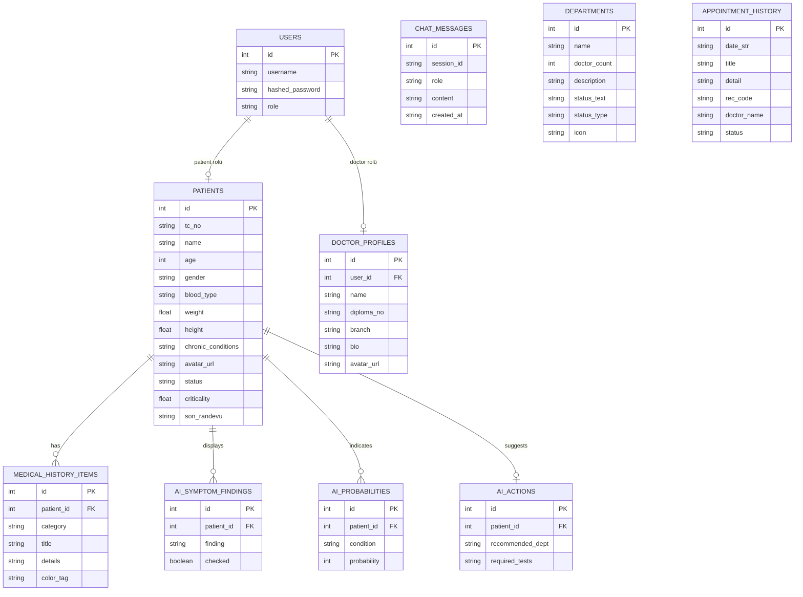
```mermaid
erDiagram
    USERS ||--o| PATIENTS : "patient rolü"
    USERS ||--o| DOCTOR_PROFILES : "doctor rolü"
    PATIENTS ||--o{ MEDICAL_HISTORY_ITEMS : "has"
    PATIENTS ||--o{ AI_SYMPTOM_FINDINGS : "displays"
    PATIENTS ||--o{ AI_PROBABILITIES : "indicates"
    PATIENTS ||--o| AI_ACTIONS : "suggests"

    USERS {
        int id PK
        string username
        string hashed_password
        string role
    }

    DOCTOR_PROFILES {
        int id PK
        int user_id FK
        string name
        string diploma_no
        string branch
        string bio
        string avatar_url
    }

    CHAT_MESSAGES {
        int id PK
        string session_id
        string role
        string content
        string created_at
    }

    PATIENTS {
        int id PK
        string tc_no
        string name
        int age
        string gender
        string blood_type
        float weight
        float height
        string chronic_conditions
        string avatar_url
        string status
        float criticality
        string son_randevu
    }
    
    DEPARTMENTS {
        int id PK
        string name
        int doctor_count
        string description
        string status_text
        string status_type
        string icon
    }
    
    APPOINTMENT_HISTORY {
        int id PK
        string date_str
        string title
        string detail
        string rec_code
        string doctor_name
        string status
    }

    MEDICAL_HISTORY_ITEMS {
        int id PK
        int patient_id FK
        string category
        string title
        string details
        string color_tag
    }

    AI_SYMPTOM_FINDINGS {
        int id PK
        int patient_id FK
        string finding
        boolean checked
    }

    AI_PROBABILITIES {
        int id PK
        int patient_id FK
        string condition
        int probability
    }

    AI_ACTIONS {
        int id PK
        int patient_id FK
        string recommended_dept
        string required_tests
    }
```

---

## 🎭 2. Kullanım Senaryoları (Use Cases)

Sistemdeki iki temel aktörün (Hasta ve Hekim) platform ile girdikleri etkileşim senaryoları:

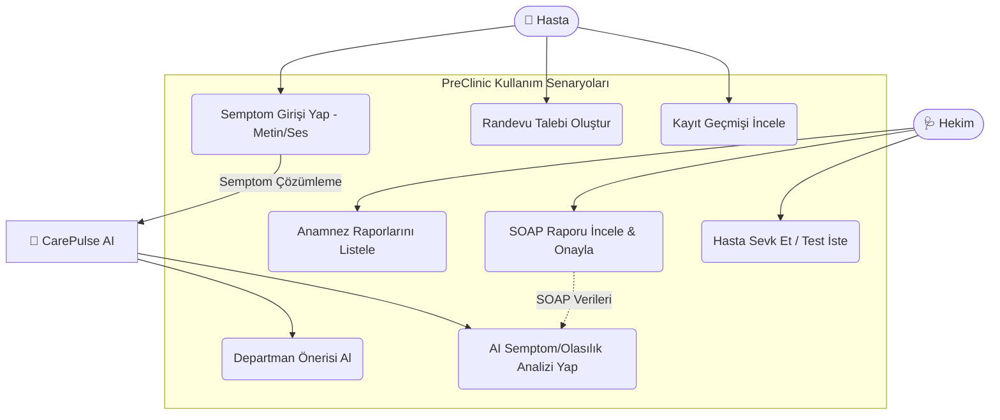
```mermaid
graph TD
    %% Aktörler
    Hasta([👤 Hasta])
    Hekim([🩺 Hekim])
    AI_Asistan[🤖 CarePulse AI]

    subgraph PreClinic Kullanım Senaryoları
        UC1(Semptom Girişi Yap - Metin/Ses)
        UC2(Departman Önerisi Al)
        UC3(Randevu Talebi Oluştur)
        UC4(Kayıt Geçmişi İncele)
        UC5(Anamnez Raporlarını Listele)
        UC6(SOAP Raporu İncele & Onayla)
        UC7(AI Semptom/Olasılık Analizi Yap)
        UC8(Hasta Sevk Et / Test İste)
    end

    %% İlişkiler
    Hasta --> UC1
    Hasta --> UC4
    Hasta --> UC3
    
    UC1 -->|Semptom Çözümleme| AI_Asistan
    AI_Asistan --> UC2
    AI_Asistan --> UC7
    
    Hekim --> UC5
    Hekim --> UC6
    Hekim --> UC8
    
    UC6 -.->|SOAP Verileri| UC7
```

---

## 🔄 3. Sistem İş Akış Şeması (Flowchart)

Semptomun hasta tarafından girilmesinden, hekim tarafından incelenip onaylanmasına kadar olan uçtan uca veri akışı:

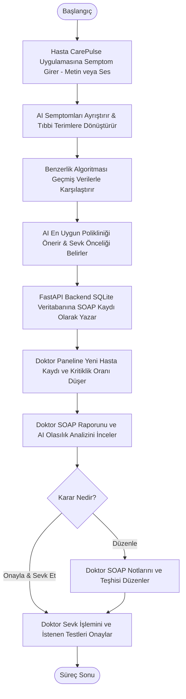
```mermaid
flowchart TD
    Start([Başlangıç]) --> P_Input[Hasta CarePulse Uygulamasına Semptom Girer - Metin veya Ses]
    P_Input --> AI_Parse[AI Semptomları Ayrıştırır & Tıbbi Terimlere Dönüştürür]
    AI_Parse --> AI_Match[Benzerlik Algoritması Geçmiş Verilerle Karşılaştırır]
    AI_Match --> Recommend[AI En Uygun Polikliniği Önerir & Sevk Önceliği Belirler]
    Recommend --> DB_Save[FastAPI Backend SQLite Veritabanına SOAP Kaydı Olarak Yazar]
    DB_Save --> Doc_Dash[Doktor Paneline Yeni Hasta Kaydı ve Kritiklik Oranı Düşer]
    Doc_Dash --> Doc_Review[Doktor SOAP Raporunu ve AI Olasılık Analizini İnceler]
    Doc_Review --> Doc_Decision{Karar Nedir?}
    Doc_Decision -->|Onayla & Sevk Et| Action_Refer[Doktor Sevk İşlemini ve İstenen Testleri Onaylar]
    Doc_Decision -->|Düzenle| Action_Edit[Doktor SOAP Notlarını ve Teşhisi Düzenler]
    Action_Edit --> Action_Refer
    Action_Refer --> End([Süreç Sonu])
```

# **Sprint 2**
## Sprint 2 Raporu: PreClinic Geliştirme ve Entegrasyon Süreci
* **Sprint Notları:** Kullanıcı hikayeleri doğrudan Product Backlog öğelerinin içerisine gömülmüş olup, detaylar ve kabul kriterleri ilgili backlog öğesinde yer almaktadır. 

* **Sprint içinde tamamlanması tahmin edilen puan:** 100 Puan

* **Puan tamamlama mantığı:** Proje boyunca tamamlanması gereken toplam 300 puanlık backlog bulunmaktadır. 3 sprinte bölündüğünde ikinci sprintin 100 puandan oluşması gerektiği kararlaştırıldı.

* **Backlog ve Görev Seçim Mantığı:** Backlog'umuz, kullanıcıların (hasta ve hekim) ihtiyaç duyacağı temel mekanik ve içerikleri en doğru sırayla besleyecek şekilde düzenlenmiştir. İlk sprint, uygulamanın genel tasarım dilini oturtmak ve en kritik iki akışı (Hasta ve Hekim arayüzleri) çözmek üzere planlanmıştır. 2. sprint ise bu oturtulan tasarım dili ve ekran haritaları üzerinden uygulamanın temel mekanik yazılımlarını, veri modellemelerini ve yapay zeka entegrasyon altyapısını kodlamak üzere kurgulanmıştır. Görevler, sprint başına tahmin edilen puan sınırını (100 Puan) geçmeyecek şekilde dengeli bir şekilde dağıtılmıştır.
Trello panomuzda yer alan kartların renk kodlaması (etiket mantığı) şu şekildedir:

     **-Pembe&Mavi Kartlar:** İlk sprint görevleri

     **-Sarı Kartlar:** Yazılımcı görevleri
  
     **-Mor Kartlar:** Backend görevleri

  
     **-Yeşil Kartlar:** Sunum-Son kontrol görevleri


* **Daily Scrum (Günlük Toplantılar):**
İletişim Kanalları: Günlük senkronizasyon toplantıları Meet üzerinden sesli olarak gerçekleştirilmiş, gün içi anlık geri bildirimler ve ekran görüntüsü paylaşımları için WhatsApp kanalı aktif olarak kullanılmıştır.

 * **Toplantı Kayıtları:** Daily Scrum ekran görüntüleri ve chat geçmişleri klasörüne ulaşmak için: [Tıklayınız](https://github.com/YZTA-Bootcamp-Group-34/Monorepo/tree/dd609f238b70489dee2c6cc7ddb8e4933276a585/sprint2bulu%C5%9Fmalar).

 * **Sprint board update:** Sprint board screenshot: Proje yönetim sürecimizi ve görev dağılımlarımızı takip ettiğimiz Trello panomuza ulaşmak için: [Tıklayınız](https://trello.com/b/1D4BDI4I/grup34)
 
 

# **Ürün Durumu (Görseller)**

Uygulamanın çalışan en son sürümüne ait canlı ürün ekran görüntüleri aşağıda listelenmiştir:

### 📱 1. CarePulse Mobil Hasta Uygulaması (Expo)
Hastaların semptom analizi yaptığı, poliklinik randevusu aldığı ve ameliyat sonrası takibini gerçekleştirdiği mobil arayüz:

<p align="center">
  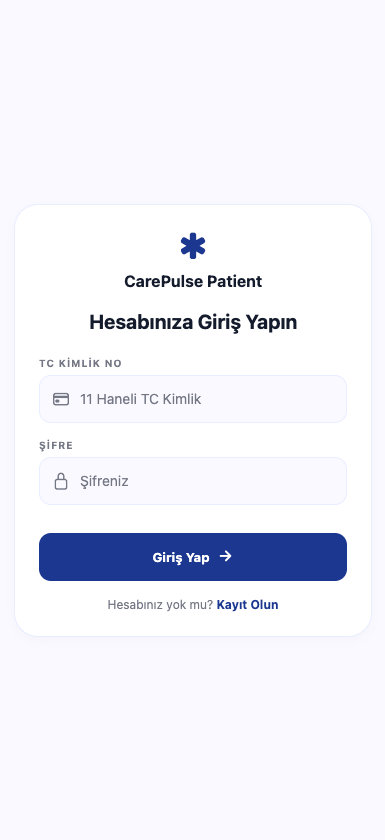
  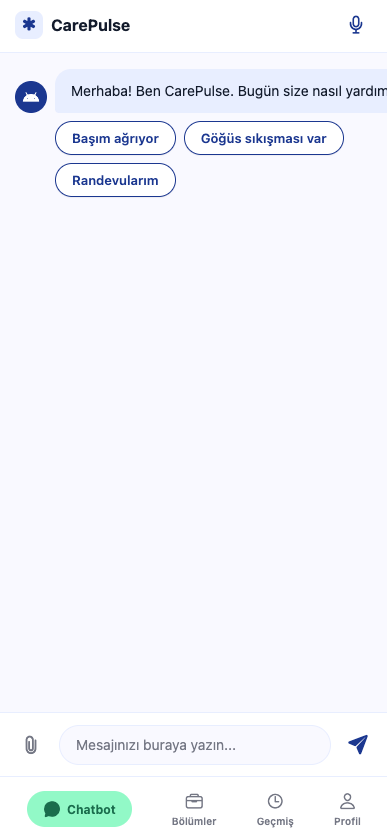
  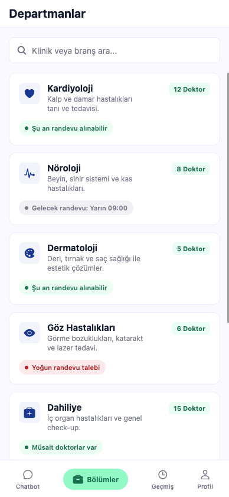
</p>
<p align="center">
  <em>Giriş Ekranı, Onboarding Tanıtım Slaytları ve Biyometrik Profil Kurulum Formu</em>
</p>

<p align="center">
  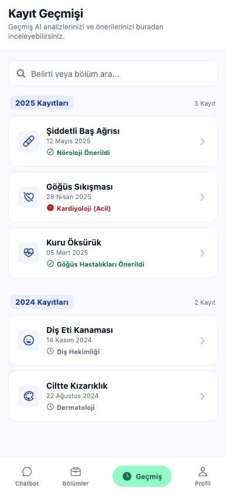
  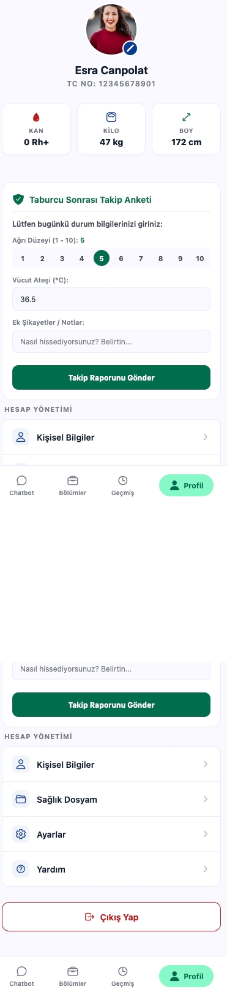
</p>
<p align="center">
  <em>CarePulse AI Asistanı Sohbet Ekranı ve Genişletilebilir Poliklinik Hekim/Saat Seçimi</em>
</p>

---

### 🩺 2. PreClinic Hekim Yönetim Paneli (Next.js)
Hekimlerin gelen hastaları, AI teşhis oranlarını, kritiklik seviyelerini ve taburcu sonrası takip alarmlarını incelediği web kontrol paneli:

<p align="center">
  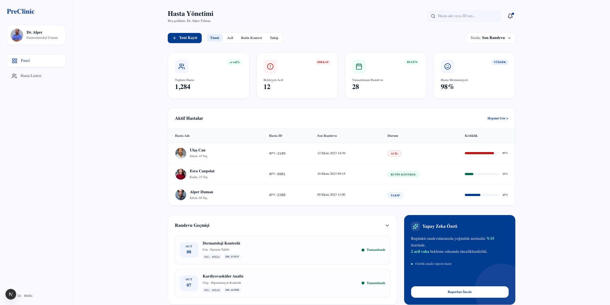
</p>
<p align="center">
  <em>Hekim Ana Dashboard Ekranı - Hasta Listesi, İskelet Yükleyiciler (Skeletons) ve Kritik Takip Alarmları</em>
</p>

<p align="center">
  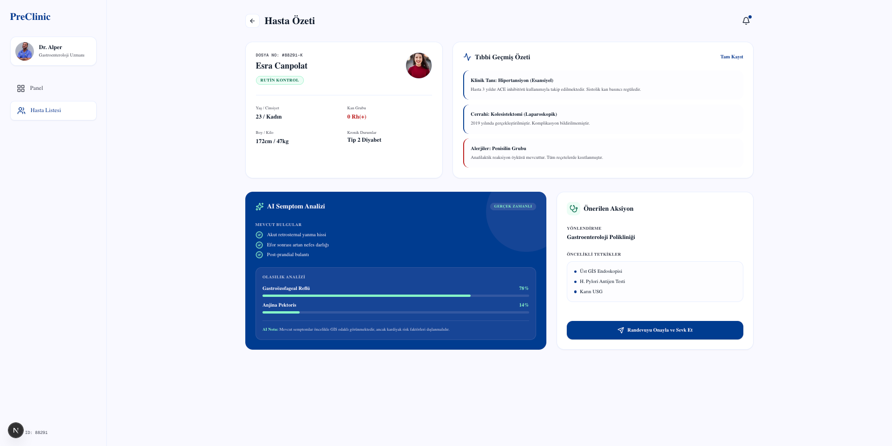
</p>
<p align="center">
  <em>Hasta Detay Ekranı - Yapay Zeka SOAP Analiz Raporu ve Klinik Risk Uyarıları</em>
</p>

<p align="center">
  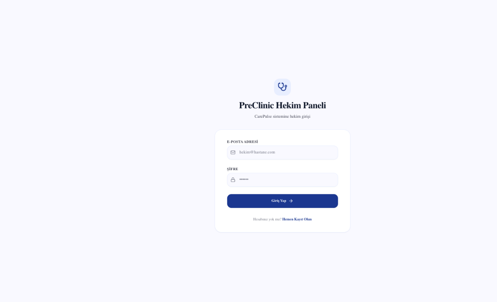
</p>
<p align="center">
  <em>Yeni Kaydolan Hekimler için Branş Kurulumu ve Lisans No Doğrulama Ekranı</em>
</p>

---

### ⚙️ 3. PreClinic Güvenli Backend Servisi (FastAPI)
Tüm servisleri besleyen, JWT Bearer yetkilendirmesiyle korunan SQLite tabanlı FastAPI RESTful API:

<p align="center">
  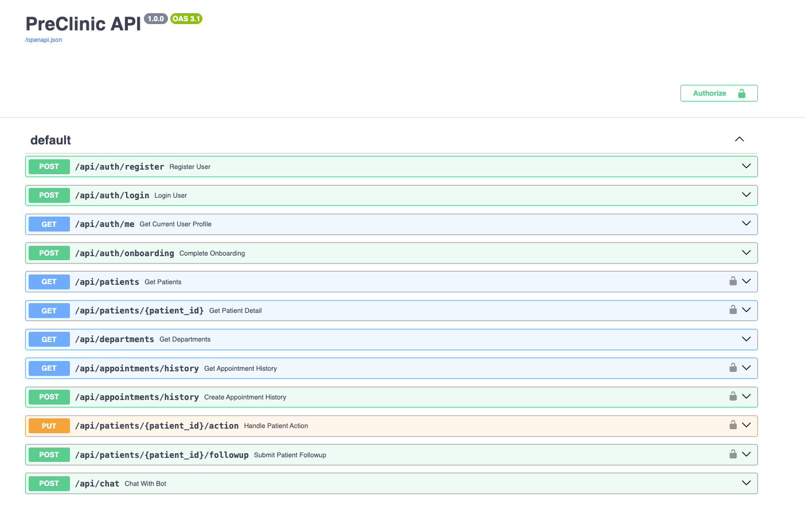
</p>
<p align="center">
  <em>FastAPI Swagger UI - Güvenli JWT API Dokümantasyon Arayüzü</em>
</p>


* **Sprint Review:**

  -Frontend kısmı tamamen bitirilmiş olup, geriye sadece Backend kısmı kalmıştır.API ksımı dışında     istenilen amaçlara ulaşışmıştır.

  -Sprint Review katılımcıları: Esra Canpolat,Ulaş Can Demirbağ,Alper Duman,Abdulaziz Nalça.

* **Sprint Retrospective:**
  *-Frontend Sürecinin Başarıyla Tamamlanması:*
   .Sprint 2'nin en büyük başarısı, uygulamanın hem mobil hem de web platformlarındaki tüm Frontend     çalışmalarının %100 oranında tamamlanmış olmasıdır.
  .Hasta ve Hekim arayüzleri, veri görselleştirme panelleri ve "Doğal dilden ICD-10 koduna dönüşüm"    ekranlarının tüm görsel kodlamaları, responsive  tasarımları ve sayfa geçişleri eksiksiz şekilde    bitirilmiştir. Kod tabanı, sonraki aşamada yapılacak olan backend entegrasyonu için tamamen
   hazır ve temiz bir hale getirilmiştir.

  *Çalışma Gruplarının Rol Dağılımı ve Sinerji:*
   Frontend aşamasının başarıyla noktalanmasının ardından, sonraki sprintlerde tasarımın kalitesini    daha da yukarı taşımak ve kalan backend/API entegrasyon sürecini hızlandırmak adına ekibin iki      uzmanlık grubuna ayrılmasına karar verilmiştir:
   * **Grup 1 (Tasarım Kalitesi) :** Esra Canpolat =>Tamamlanan frontend ekranlarının görsel            kalitesini denetleyecek, kullanıcı deneyimini  optimize edecek ve sonraki aşamalar için görsel      standartları koruyacaktır.
  * **Grup 2 (Yazılım Ekibi):** Ulaş Can Demirbağ, Alper Duman, Abdulaziz Nalça=> Tamamen biten        arayüzlerin arkasına kurulacak olan veritabanı, yapay zeka API bağlantıları ve backend              süreçlerini üstlenecektir.

  *Toplantı ve İletişim Düzeni:*
  .Frontend aşamasından backend aşamasına geçişteki koordinasyonu kusursuz sağlamak adına,             toplantıların belirli ve sabit zaman aralıklarıyla (periyodik olarak) gerçekleştirilmesi            kararlaştırılmıştır. Bu sayede tasarım revizeleri ve kod entegrasyonları anlık olarak senkronize    edilecektir.


* **Gelecek Sprint Hazırlığı:** 
  . Geliştirme sürecinde herhangi bir aksama yaşanmaması adına, üretim aşamasında görev alan ekip üyelerine sonraki bölümlerde ve ekranlarda ihtiyaç duyulabilecek tüm görsel materyallerin, ikon setlerinin ve arayüz bileşenlerinin yer aldığı detaylı listeler hazırlanmış ve teslim edilmiştir.


# **Sprint 3**
## Sprint 3 Raporu: PreClinic Geliştirme ve Entegrasyon Süreci

* **Sprint Notları:** PreClinic Backend Entegrasyonu ve Proje Kapanışı

* **Sprint içinde tamamlanması tahmin edilen puan:** 100 Puan

* **Puan tamamlama mantığı:** Proje boyunca tamamlanması gereken toplam 300 puanlık backlog bulunmaktaydı. 3 sprinte bölünen sürecin son 100 puanlık kapanış evresi de bu sprint başarıyla tamamlanarak toplamda 300 puana ulaşılmış ve proje kapatılmıştır.
  
* **Backlog ve Görev Seçim Mantığı:** İlk iki sprintte tasarım dili oturtulan ve frontend aşamaları %100 bitirilen PreClinic uygulamasının, bu son sprintte API Key entegrasyonları, canlı veri bağlantıları ve sistem testleri tamamlanmıştır. Doktor Paneli başta olmak üzere tüm sistem fonksiyonel olarak çalışır duruma getirilmiş ve uygulama tamamen bitirilmiştir. Görevler, sprint puan sınırını (100 Puan) geçmeyecek şekilde ekipler arasında dengeli dağıtılmıştır.

* **Daily Scrum (Günlük Toplantılar):**
İletişim Kanalları: Günlük senkronizasyon toplantıları Meet üzerinden sesli olarak gerçekleştirilmiş, gün içi anlık geri bildirimler ve ekran görüntüsü paylaşımları için WhatsApp kanalı aktif olarak kullanılmıştır.


 * **Toplantı Kayıtları:** Daily Scrum ekran görüntüleri ve chat geçmişleri klasörüne ulaşmak için: [Tıklayınız](https://github.com/YZTA-Bootcamp-Group-34/Monorepo/tree/ce6d14c510084cc986eddaf724667a105b527411/toplant%C4%B1%20kay%C4%B1tlar%C4%B1son).


 * **Sprint board update:** Sprint board screenshot: Proje yönetim sürecimizi ve görev dağılımlarımızı takip ettiğimiz Trello panomuza ulaşmak için: [Tıklayınız](https://trello.com/b/1D4BDI4I/grup34)*
 
      


* **Sprint Review:**

  -Projenin son aşaması olan bu sprintte, API entegrasyonu ve backend bağlantıları dahil olmak üzere uygulamanın **her şeyi tamamen bitirilmiştir**. Geliştirilen tüm modüller ve Doktor Paneli canlı senaryolarla uçtan uca **test edilmiş ve eksiksiz bir şekilde çalıştığı onaylanmıştır**. Projenin kapanışı için gerekli olan **sunum dosyası hazırlanmış** ve uygulamanın tüm çalışma mantığını gösteren **YouTube videosu hazır hale getirilmiştir**. PreClinic projesi hedeflenen tüm çıktılarıyla başarıyla tamamlanmıştır.
  
  -Sprint Review katılımcıları: Esra Canpolat,Ulaş Can Demirbağ,Alper Duman,Abdulaziz Nalça.


* **Sprint Retrospective:**
  * **Proje Kapanışı ve Genel Başarı:** PreClinic projesinin son sprinti olan Sprint 3 başarıyla tamamlanmış ve uygulamanın tüm fonksiyonları çalışır vaziyette teslim edilmiştir. 
  * **Entegrasyon ve Test Süreci:** Bir önceki sprintte devralınan online sistem/veri senkronizasyonu altyapısı bu süreçte tamamen çözülmüş, backend ve API bağlantıları kurularak tüm sistem uçtan uca test edilmiştir.
  * **Ekip İçi Sinerji:** Ekip üyelerinin bu sprintteki yüksek motivasyonu ve aktif katılımı sayesinde hem kodlama hem de sunum/video hazırlık süreçleri zaman planlamasına uygun şekilde yürütülmüştür.
  * **Multidisipliner Çalışma:** Tasarım ekibinin iş yükünün azalmasıyla birlikte yazılım ve test süreçlerine verdikleri aktif destek, projenin tam zamanında bitirilmesinde ve stabil çalışmasında büyük rol oynamıştır.
  * **Kapanış Çıktıları:** Sunum dosyası ve YouTube tanıtım videosu gibi projenin son adımları da eksiksiz şekilde hazırlanarak teslim aşamasına gelinmiştir.
  *  **Toplantı ve İletişim Düzeni:** Backend entegrasyonu, API bağlantıları, test süreçleri, YouTube tanıtım videosu ve kapanış sunumu gibi projenin tüm son adımlarını kusursuz koordine etmek adına toplantılar periyodik olarak gerçekleştirilmiştir. Bu sıkı iletişim düzeni sayesinde tüm süreçler anlık olarak senkronize edilmiş ve projenin her detayı başarıyla bitirilmiştir.


# 🎬 Uygulama Tanıtım Videosu

PreClinic projesinin tüm çalışma mantığını, mobil hasta uygulamasını, CarePulse AI triyaj & SOAP üretimi akışını ve hekim yönetim panelini içeren YouTube tanıtım videosunu aşağıdaki bağlantıdan veya görsele tıklayarak izleyebilirsiniz:

<p align="center">
  <a href="https://www.youtube.com/watch?v=nNC-Fhe0jNU">
    
  </a>
</p>

🔗 **YouTube Video Linki:** [https://www.youtube.com/watch?v=nNC-Fhe0jNU](https://www.youtube.com/watch?v=nNC-Fhe0jNU)


